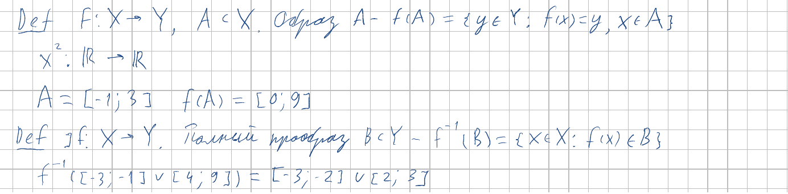
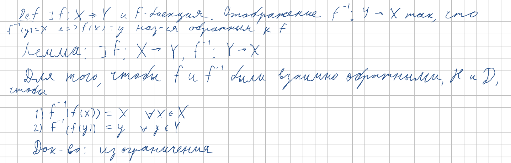
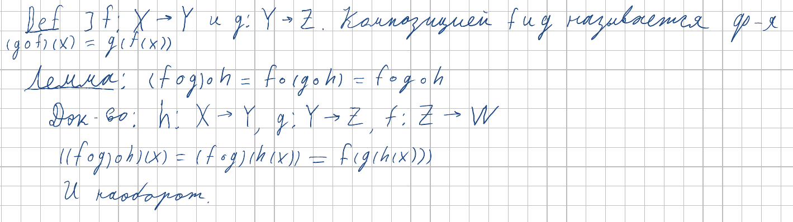

<h2>2. Понятие функции и отображения. Обратная функция, сложная функция. Операции над образами и прообразами.</h2>

***<ins>Сложность: 4/10</ins>***

Несмотря на то, что в названии темы есть "сложная функция" - это не сложная тема. Билет представляет собой базовые понятия отображений и функций, которые мы уже видели в дискретной математике. Проблемы могут вызвать только свойства образов и прообразов, а именно их доказательство. Оставим это в качестве упражнения внимательному читателю.

### Определения

### Свойства

### Инъекция, сюръекция, биекция

### Обратная функция

### Композиция (сложная функция)

