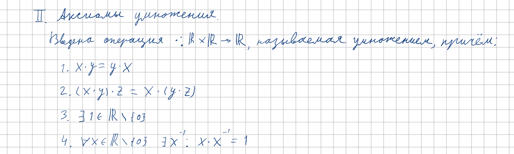

<h2>3.Система аксиом множества вещественных чисел. Основные следствия из аксиом. Расширение множества вещественных чисел</h2>

***<ins>Сложность: 6/10</ins>***

Данный билет уже заметно сложнее (душнее). Мы задаём всё множество действительных чисел просто операциями на этом множестве и аксиомой неприрывности, а затем уже определяем отношение порядка, следствия из аксиом и расширяем множество, добавляя знаки +-inf. Стоит повторить определение аксиом и названия свойств, таких как ассоциативность и дистрибутивность, особенно уделить внимание аксиоме неприрывности, тк это не очень очевидная штука. Могут попросить подоказывать единственность нуля и прочие противные следствия, но это очевидно выводиться прямо перед экзаменатором за пару секунд. Если держать в голове структуру рассказа, то сложность билета падает до 1-2/10.

 <h3>Аксиомы сложения</h3>

<h3>Аксиомы умножения</h3>

<h3>Аксиомы связи сложения и умножения </h3>

<h3>Аксиомы неприрывности</h3>

<h3>Очевидные следствия</h3>

<h3>Аксиомы порядка и расширение множества</h3>

