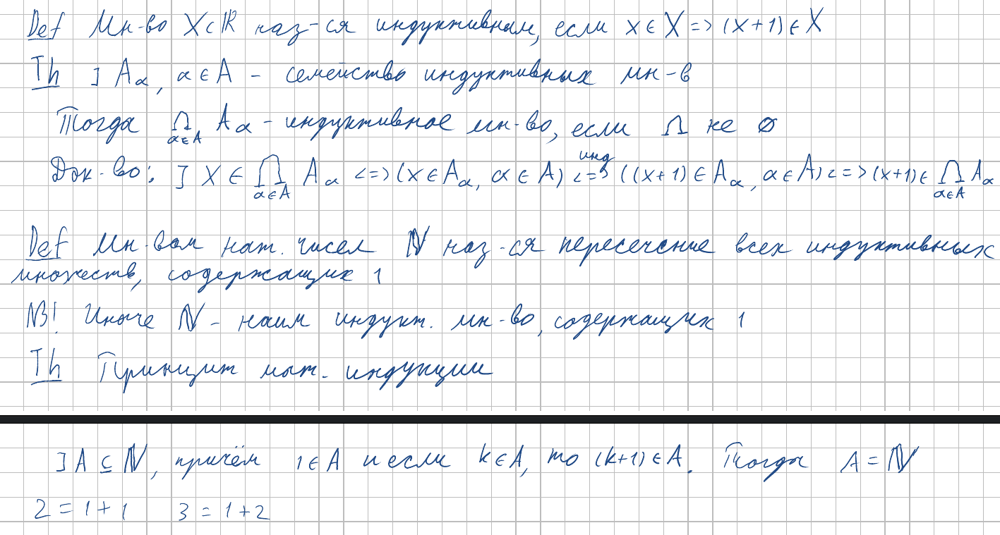

 

<h2>4. Индуктивные множества, множество натуральных чисел, принцип математической индукции. Бином Ньютона.</h2>

***<ins>Сложность: 3/10</ins>***

Билет совсем простой, особенно если привыкнуть к тому, что множество натуральных чисел мы задаём пересечением. В биноме просто используем правило из треугольника Паскаля (свойство 4 сочетаний) и чиллим.

### Индуктивные множества, натуральные числа и принцип мат. индукции

### Факториал и сочетания

### Бином

