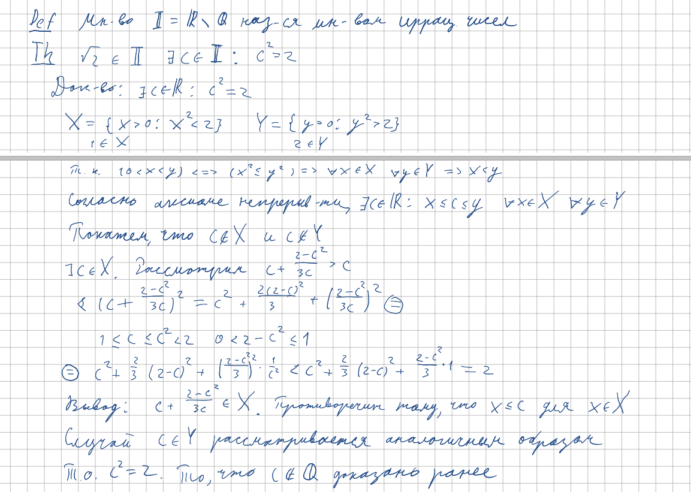

<h2>5.Целые, рациональные и иррациональные числа. Существование иррациональных чисел. Иррациональность корня из двух<h2>

***<ins>Сложность: 2/10</ins>***

Билет очень короткий и простой, но с одним условием, а именно, что вы хорошо понимаете билеты 3 и 4. Только этот факт не позволил мне поставить отрицательную сложность. В математическом анализе так получается, что мы выходим к привычным нам целым и рациональным числам только после определения вещественных и натуральных. Таким образом, вся аксиоматика опирается на предыдущие выводы, оставляя данный билет очень скудным и неинтересным. Однако всё же можно найти интерес  и тут, в доказательстве <em>самого существования </em> иррациональных чисел. Это делается через очень интересные умозаключения, с использованием почти всей предыдущей теории, являясь таким образом заключением первой глобальной темы нашего курса. Как интересный факт к данному неинтересному билету, стоит отметить, что аксиоматика Дедекинда, определяющая вещественные числа через сечения, доказывает существование иррациональных чисел как одно из первых утверждений, строя именно на этом фундаментальном факте дальнейшие рассуждения. Забавно, как настолько разными способами можно сказать одно и тоже.

<h3>Рациональные числа</h3>

<h3>Иррациональные числа</h3>

