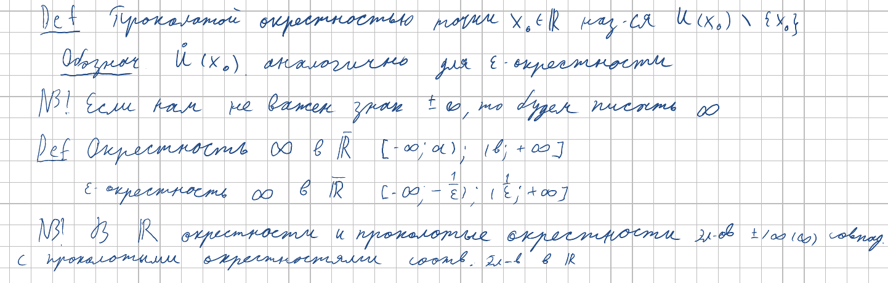
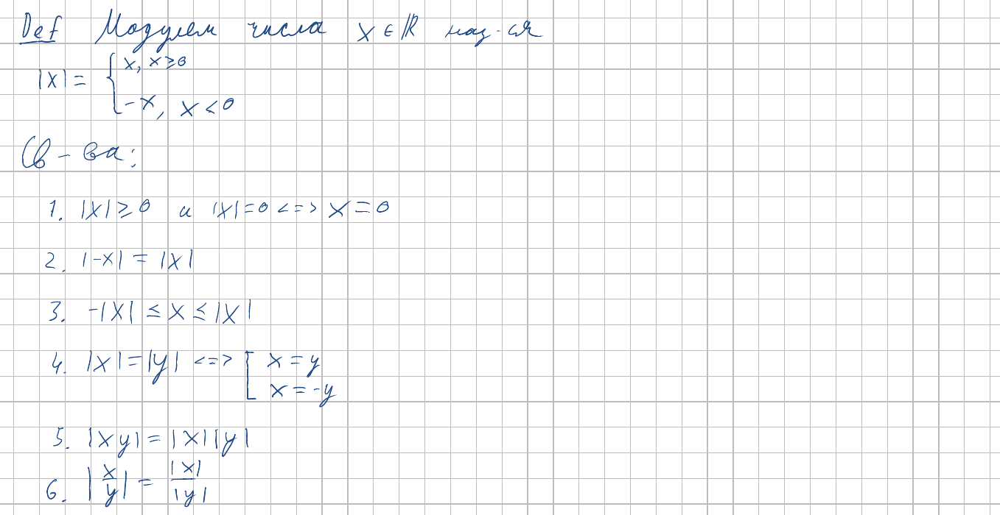
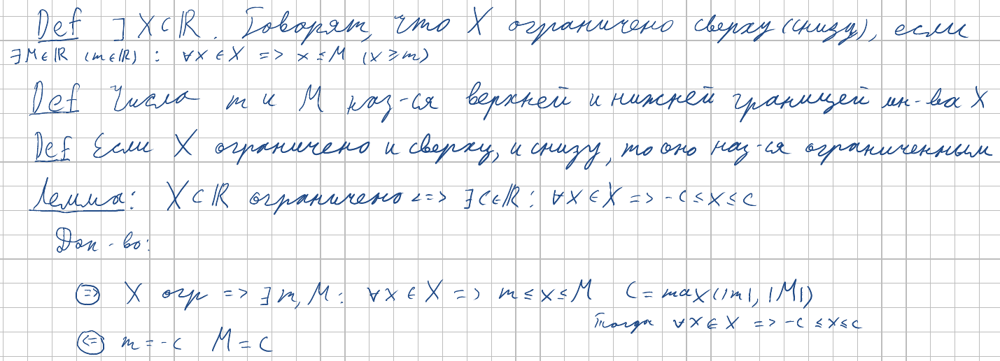
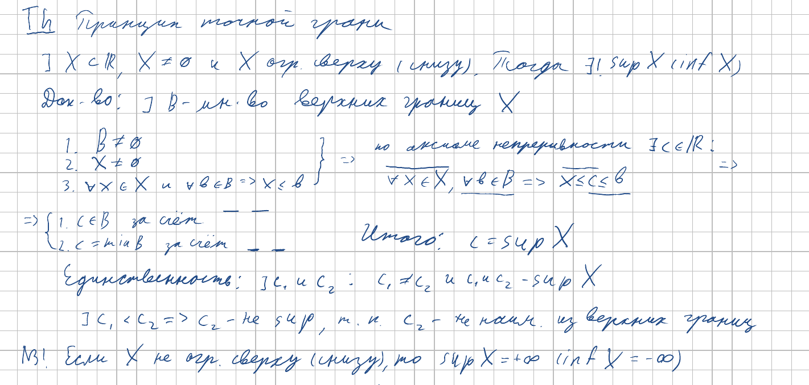
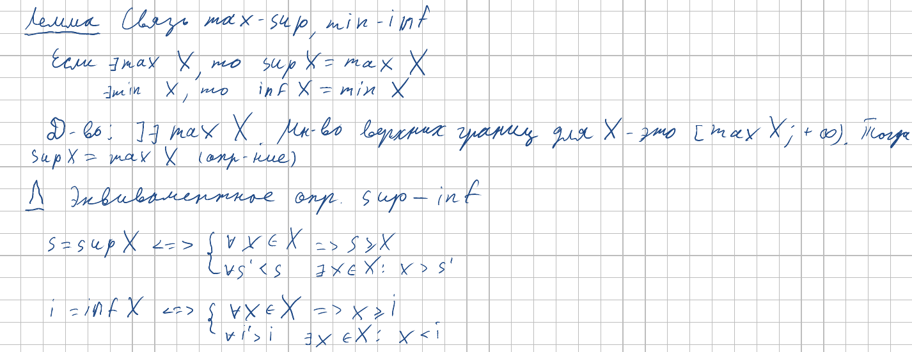

<h2>6. Понятие окрестности. Модуль вещественного числа и его свойства. Ограниченность числовых множеств. Принцип точной верхней грани.</h2>

***<ins>Сложность: 7/10</ins>***

Не сказать, что темы в этом билете сложные, но их прямо много. Стоит обратить внимание на окрестности бесконечностей в $\mathbb{R}$ и $\overline{\mathbb{R}}$, ибо может быть не интуитивно понятным. Также стоит полюбить неравенство треугольника, так как потом оно будет использоваться очень часто. Последнее эквивалентное определение будет использоваться в принципе Архимеда.

### Окрестности

### Модуль

### Ограниченность

### Max/sup, min/inf

### Принцип точной верхней грани

### Полезные леммы

