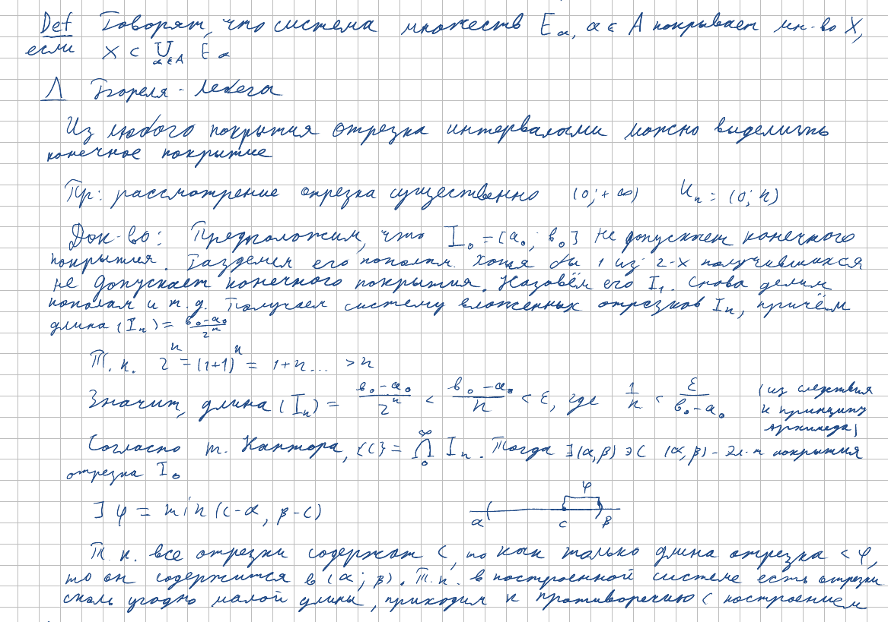
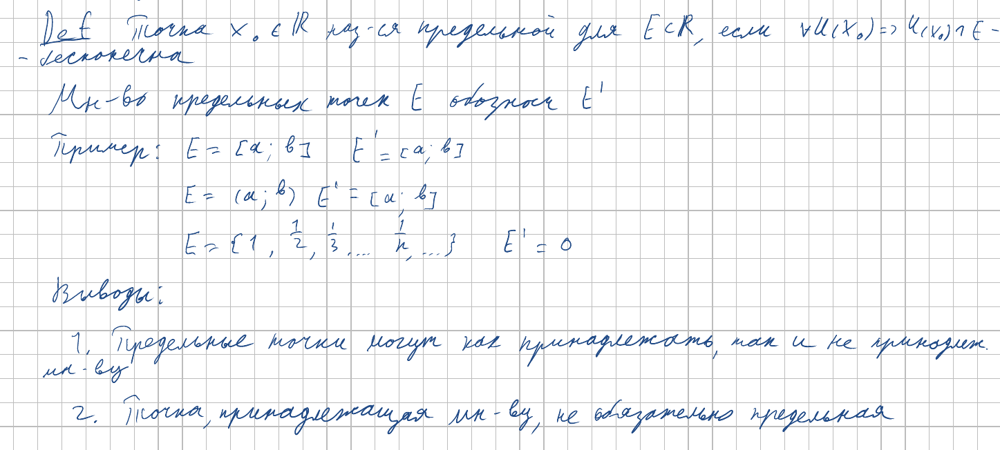
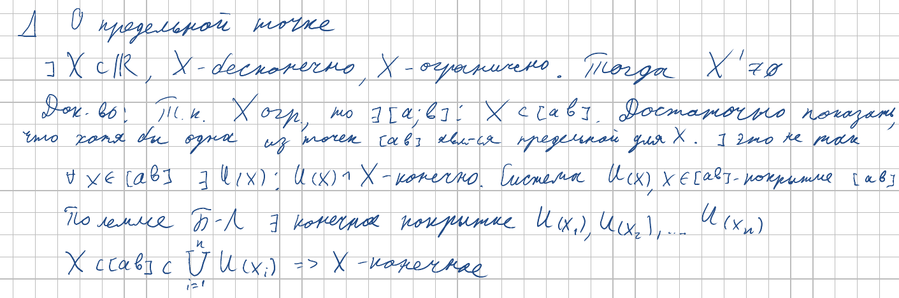

<h2>8. Лемма Бореля-Лебега. Лемма о предельной точке.</h2>

***<ins>Сложность: 4/10</ins>***

Как говорил Бойцев, доказываем не от приятного. Если порисовать картиночки, всё становится понятно, но интуиции при этом особо не добавляется. Но всё равно несложно, если прокрутить в голове док-ва раза 2. Позже мы применим эти леммы в замкнутых множествах.

### Лемма Бореля-Лебега

### Предельные точки

