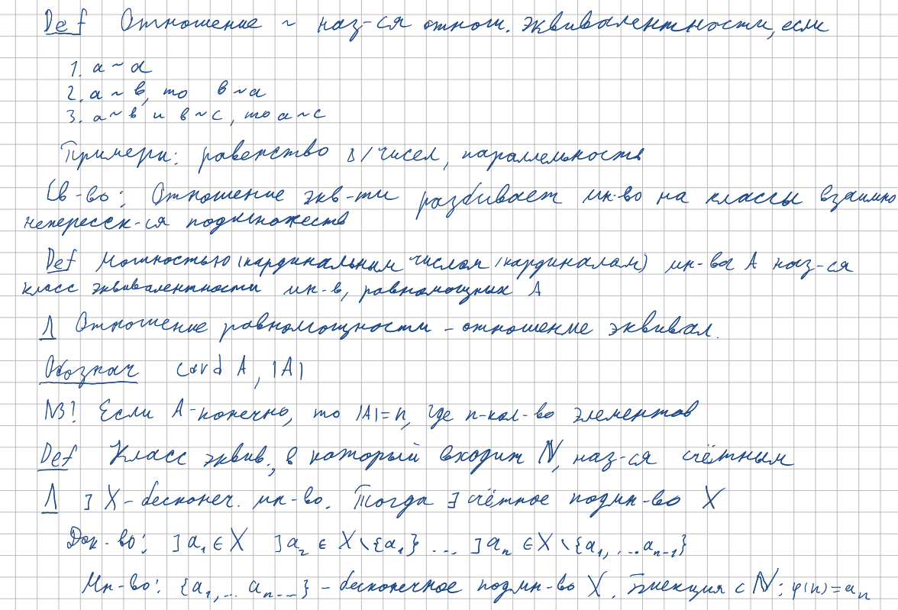

<h2>9.Понятие замкнутого множества. Существование максимума и минимума. Мощность множества. Счетные множества.</h2>

***<ins>Сложность: 2/10</ins>***

И опять наипростейший билет! Рассказ про замкнутое множество и, соответственно, про обязательное существование максимума и минимума в нём, занимает от силы 4 минуты, при должной компетенции докладчика естественно. А затем идёт совершенно непонятный для меня прыжок, и вот студент уже должен показать своё знание базовых концепций  теории множеств по Кантору. Лучшим советом который я могу дать, будет совет отчётливо в своей голове разбить этот билет на две отдельные темы, разнеся таким образом несвязанные понятия подальше друг от друга. Это обязательно результируется в быстром и чётком ответе, тк никаких неточностей даже в теории быть тут не может.

<h3>Замкнутое множество</h3>

<h3>Существование min/max и мощность множества</h3>

<h3>Классы эквивалентности и счётные множества</h3>

