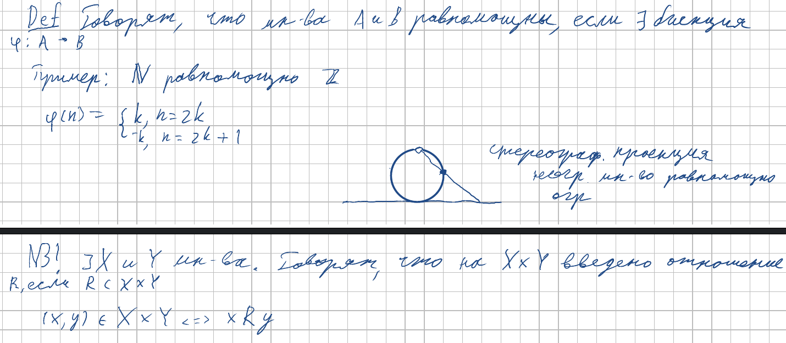
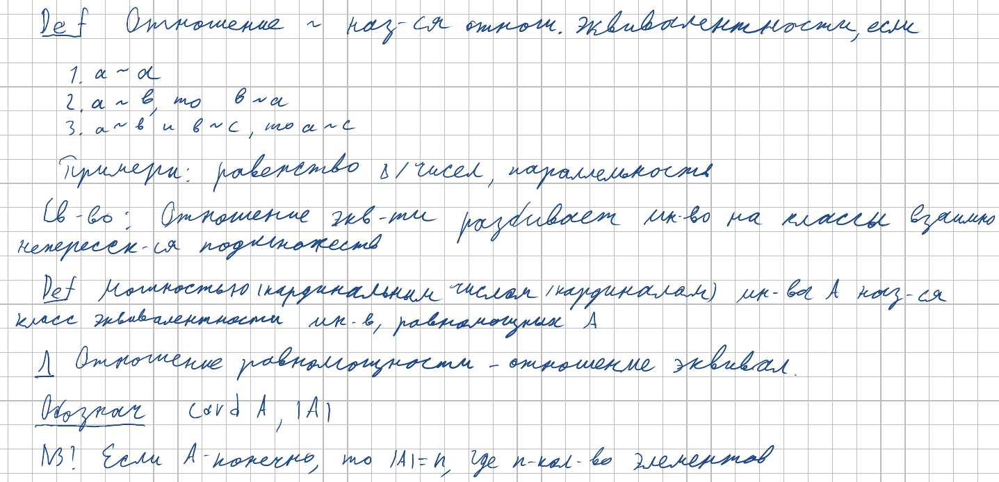
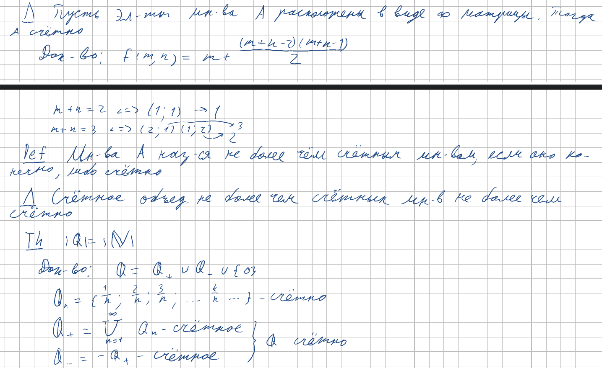
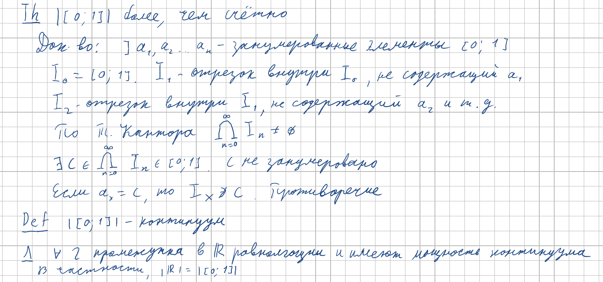

<h2>10. Мощность множества. Несчетные множества. Теорема Кантора. Континуальность множества вещественных чисел.</h2>

***<ins>Сложность: 3/10</ins>***

На чилле расказываем про понятия из дискретки, а потом внезапно перескакиваем на теорему Кантора. Но она уже была в 7 теме, так что обойдёмся без неё.

### Мощность

### Счётные множества

### Континуальность вещественных чисел

