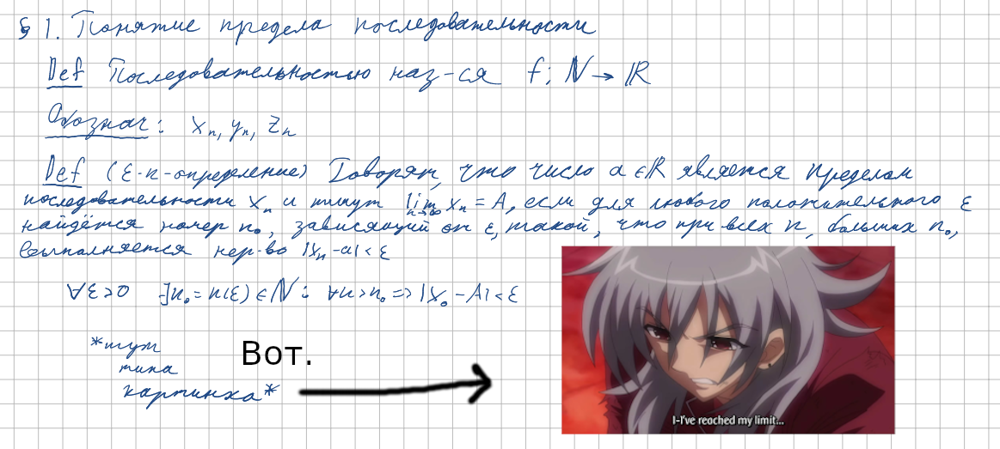
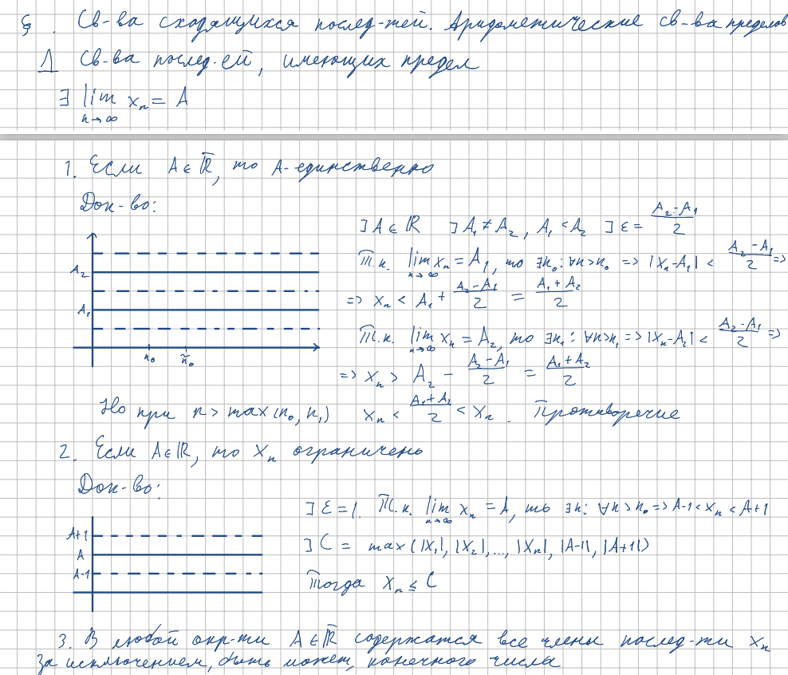

<h2>11. Понятие предела последовательности. Свойства сходящихся последовательностей.</h2>

***<ins>Сложность: 4/10</ins>***

Основной для понимания текущего состояния курса билет. Требуется чёткое понимание определения и идущих с ним рука об руку свойств. Объём доказательств немного поднимает сложность, но каждое из них само по себе элементарно. Как совет для запоминания определения рекомендуется в обязательном порядке прослушивание песни НТР - Предел.

<h3>Определение предела</h3>

<h3>Свойства сходящихся последовательностей</h3>

