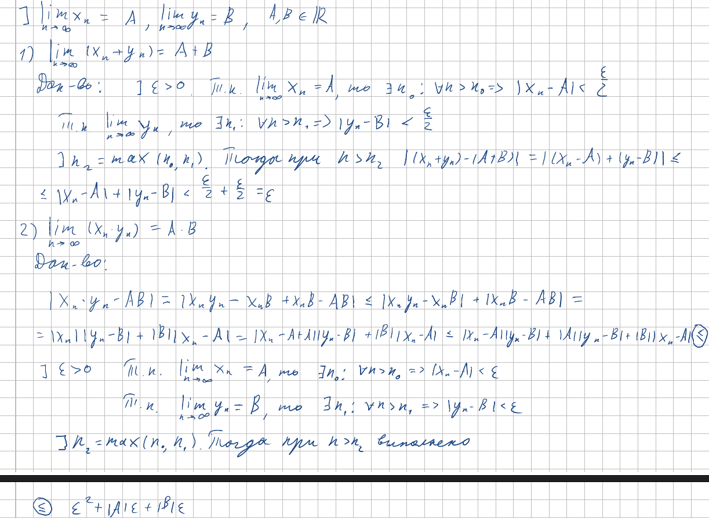
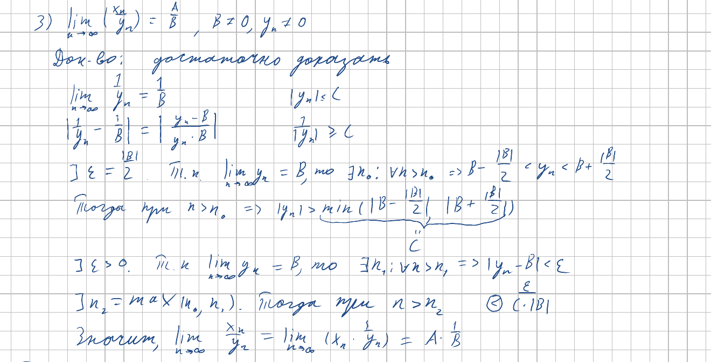
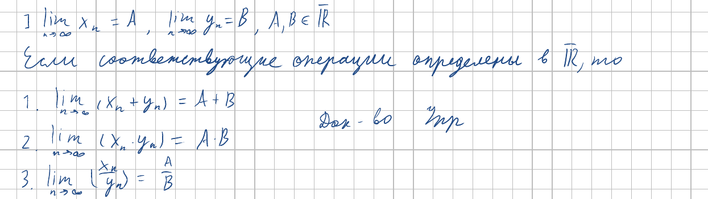

<h2>12. Арифметические свойства пределов.</h2>

***<ins>Сложность: 3/10</ins>***

Простая тема. Не забываем про неравенство треугольника и про то, что на ноль делить нельзя.

### Арифметические свойства пределов

### Расширенные арифметические операции

