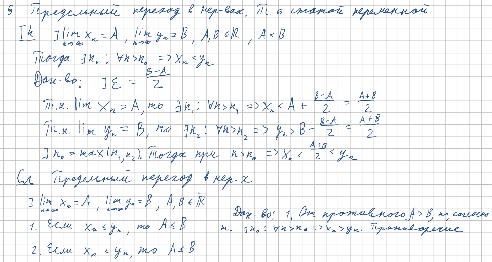
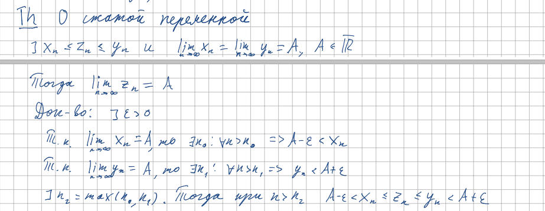

<h2>13. Предельный переход в неравенствах. Теорема о сжатой переменной.</h2>

***<ins>Сложность: 3/10</ins>***

Весь данный билет поместился на одном повороте доски у Бойцева, так что не вижу даже теоретически возможных проблем с ответом. Стоит учесть однако, что строгий знак в неравенстве между последовательностями вовсе не результируется в строгом же знаке между пределами этих последовательностей. Мне лично всегда помогал запомнить это быстрый контр-пример:  $x_n$ = $\frac{1}{n}$;    $y_n$ = -$\frac{1}{n}$  Тогда выполняется строгий знак, однако их пределы равны друг другу и нулю. Надеюсь такое доходчивое пояснение поможет всем читающим.

<h3>Пределы и неравентсва</h3>

<h3>Теорема о сжатой переменной</h3>

