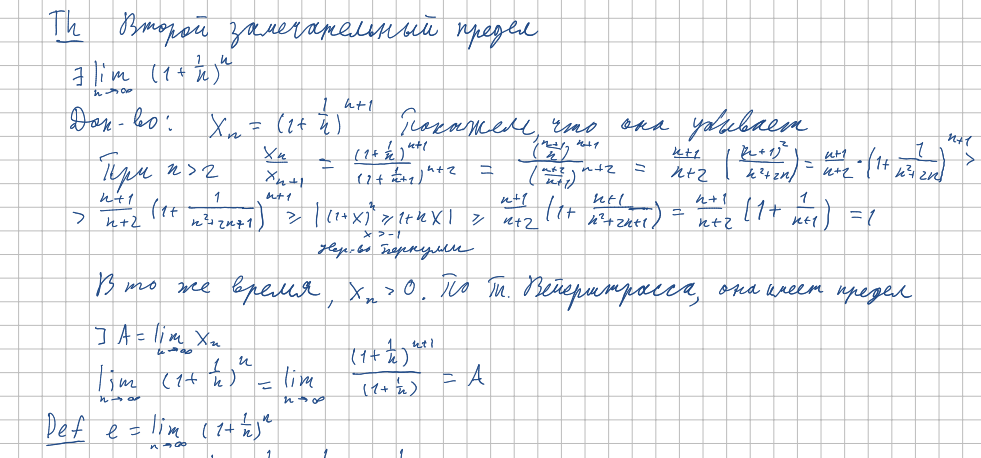
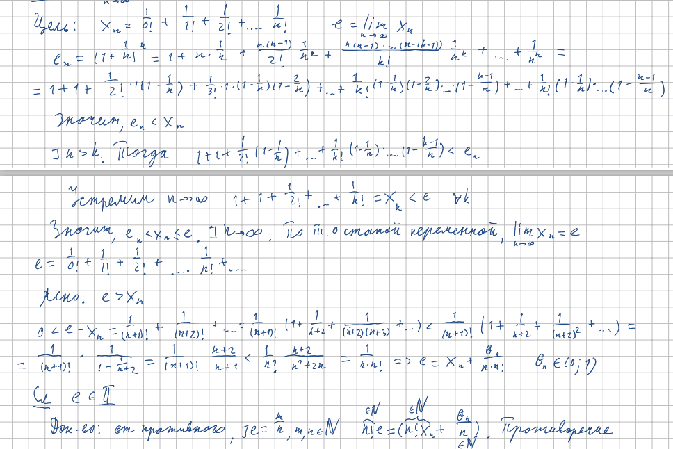

<h2>15.Число e как предел последовательности. Иррациональность числа e .</h2>

***<ins>Сложность: 5/10</ins>***

Один из наиболее сложных с технической точки зрения билетов. Требуется чёткость доказательств и ясность ума. Опять же поможет структура в голове, индукционные логические переходы тянут один другой, давая линейную прямоту повествования. Стоит помнить про переход от рассмотрения последовательности с индексом n к n+1, чтобы реализовать убывание, а следовательно и воспользоваться теоремой Вейерштрасса. С иррациональностью ещё хуже. Для этого придётся вспомнить, что такое бином и довольно строго выполнить ряд не совсем очевидных преобразований, хоть и довольно простых в своей сущности.

<h3>Второй замечательный предел</h3>

<h3>Как посчитать e, разложение в ряд, иррациональность</h3>

