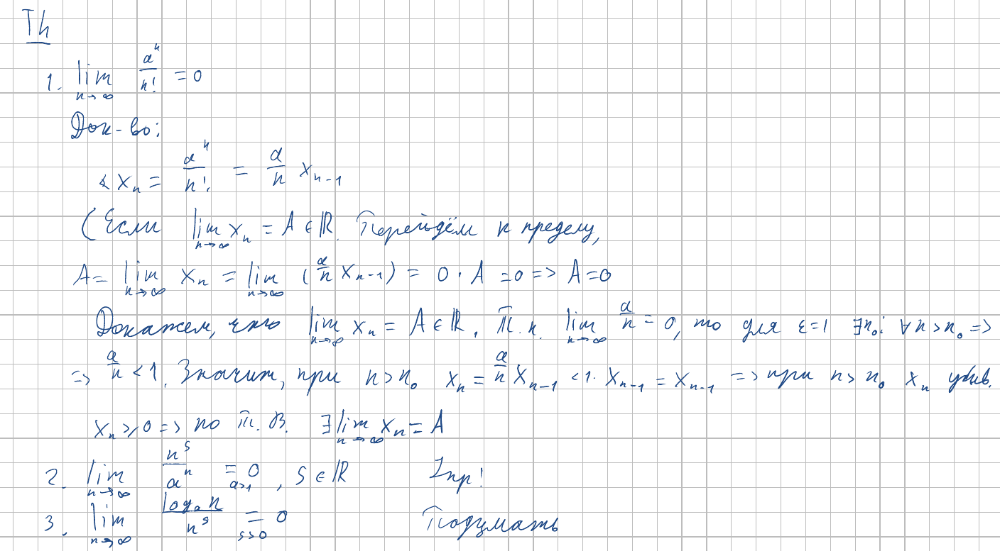
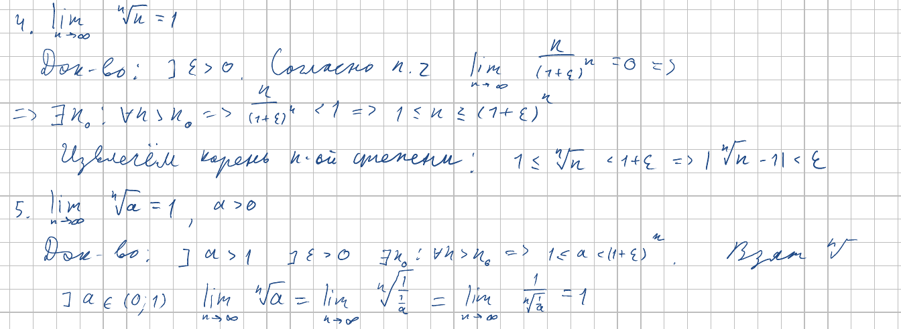

<h2>16. Асимптотическое сравнение скорости роста функций: факториал, показательная, степенная, логарифмическая.</h2>

***<ins>Сложность: 7/10</ins>***

Доказательства 2 и 3 оставляем как упражнение внимательному читателю.

