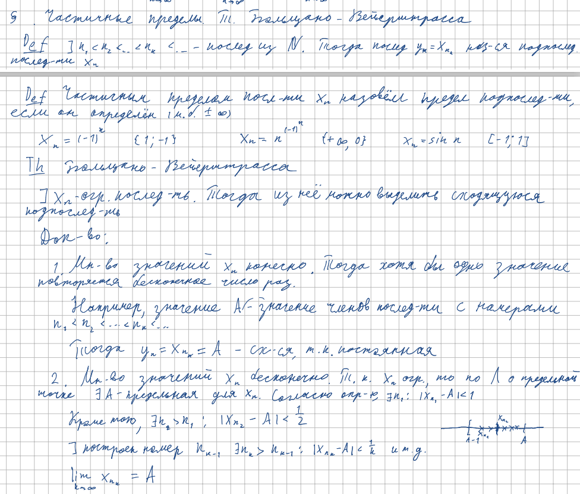
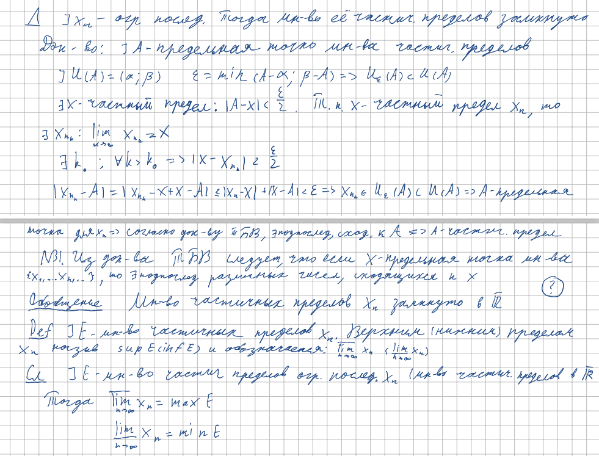
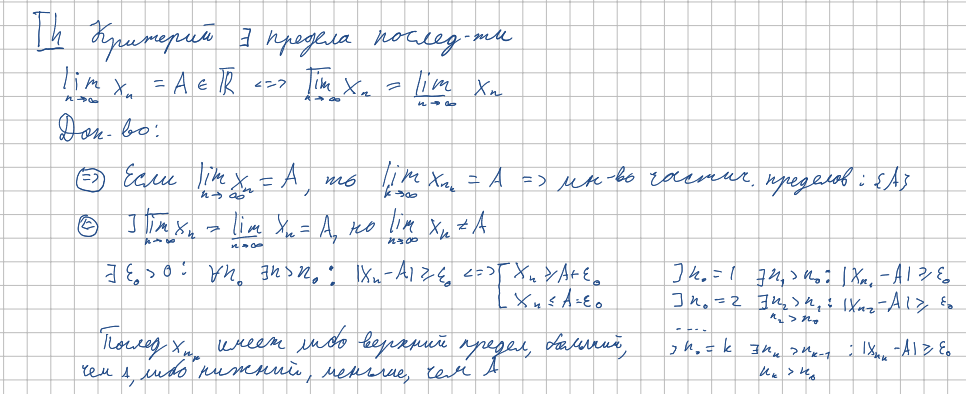

<h2>17. Частичные пределы. Теорема Больцано-Вейерштрасса. Верхний и нижний пределы. Критерий существования предела последовательности.</h2>

***<ins>Сложность: 7/10</ins>***

Единственный неиронично сложный билет. Требует кристального понимания всех сущностей из курса математического анализа, а также неплохое геометрическое мышление, или же хорошую память, чтобы просто выучить все элегантные доказательства, без понимания их. Удобно представлять подпоследовательность как функцию от натурального аргумента n над индексом изначальной последовательности, получая таким образом правило селекции новых элементов. Сама теорема не так трудна как сущности окружающие её, так что не стоит концентрировать внимание только на ней, она ничего не даст без понимания сопутствующих терминов и образов.

<h3>Частичные пределы и теорема Больцано-Вейерштрасса</h3>

<h3>Верхний и нижний пределы</h3>

<h3>Критерий существования предела последовательности</h3>

