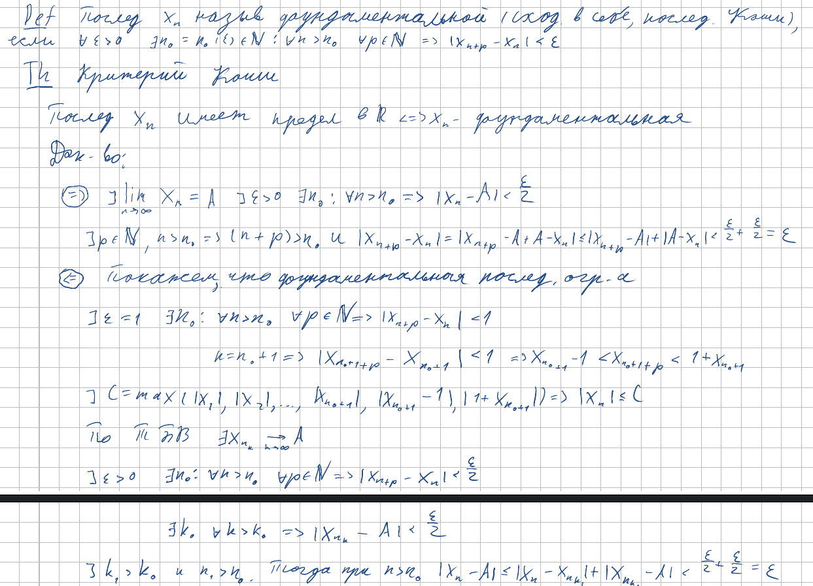
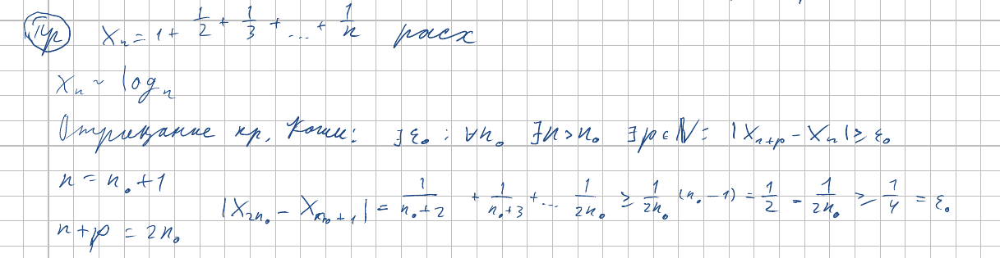

<h2>18. Критерий Коши. Расходимость последовательностей 1 + 1/2 + 1/3 + ... + 1/n и sin(n).</h2>

***<ins>Сложность: 7/10</ins>***

Тема небольшая, но опирается на не сильно приятную предыдущую тему. К тому же, надо подумать над расходимостью синуса, ведь с целыми аргументами он принимает неудобные значения. Что-то похожее было на практике, но это надо ещё вспомнить.

### Критерий Коши

### Расходимость

sin n, как обычно, оставляем в качестве упражнения внимательному читателю
