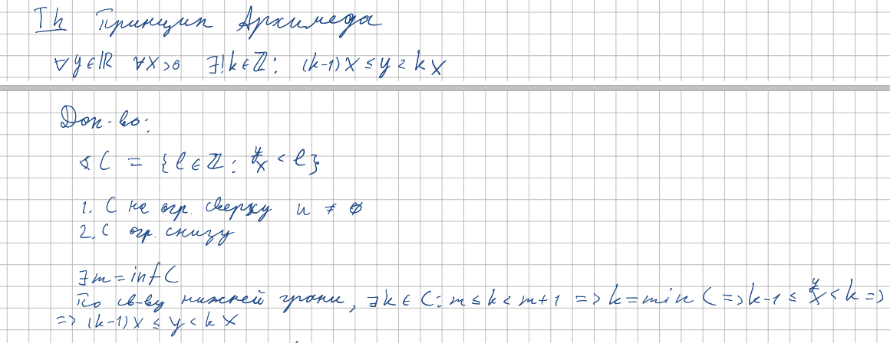
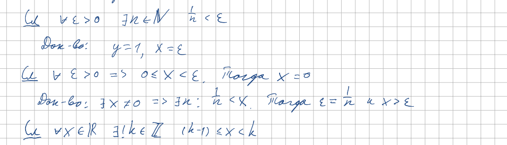
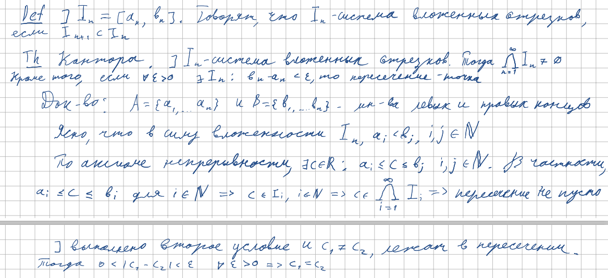

<h2>7.Принцип Архимеда и следствия из него. Теорема Кантора.</h2>

***<ins>Сложность: 4/10</ins>***

Данный билет достаточно самобытен, он описывает и доказывает две довольно важные в нашем курсе теоремы. Принцип Архимеда, хоть и кажеться очевидным, на самом же деле влечёт много полезных свойств, подготавливая голову студента к введению определения предела в будущем. О великой теореме Георга Кантора  Я думаю не слышал только совсем отдалённый от математики гуманитарий, так что любые комментарии будут излишни. Всё, что требуется знать для успешной сдачи этого билета будет находиться дальше в конспектах, так что от себя могу лишь посоветовать представить геометрическую интерпритацию этих теорем. Не зря Архимед был особенно успешен именно в области геометрии, Его теорема очень хорошо ложиться на язык отрезков на двумерной плоскоти, утверждая по сути возможность покрытия более длинного отрезка короткими, с возможным избытком не более одной длинны меньшего отрезка. Вложенные отрезки Кантора также прекрасно рисуются, а сам факт кажеться настолько очевидным, что его доказательство само приходит на ум. 

<h3>Принцип Архимеда</h3>

<h3>Следствия из принципа Архимеда</h3>

<h3>Теорема Кантора</h3>

